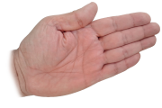
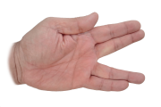

#  SPOCK-GAME

***

This is a web-site version of the famous "Rock-Paper-Scissors-Lizard-Spock" game invented by Sam Kass and Karen Bryla, and popularized in the "The Big-Bang Theory" television series.
This in turn is based on the popularly known hand game "Rock-Paper-Scissors" but with two more hand shapes to the list of weapons. The game mechanics remain the same, but the relationship between all elements is doubled in an attempt to minimise the chances of a draw.
This game represents a symbolic combat, between two or more players, where the weapons used are certain stances created with the hand of each player.  In the case of the classic "Rock-Paper-Scissors", there are 3 defined stances, each one symbolically identifying a rock, a piece of paper or a pair of scissors.
In the case of the reformed "Rock-Paper-Scissors-Lizar-Spock", there are 2 additional defined positions, each symbolically identifying a lizard and the mythical character Spock from the Star Trek series.

## The game
This game requires at least and preferably two players. The player's hand (either right or left) is used to represent the weapon used in each round.
Players are free to use any of the following 5 defined weapons/hand positions:
|**Rock**|**Paper**|**Scissors**|**Lizard**|**Spock**|
|:---:|:---:|:---:|:---:|:---:|
| |||||
||||||

All players must reveal their weapon at the same time and simultaneously, and the outcome of the round will be determined by the following table:

|            |**Rock**|**Paper**|**Scissors**|**Spock**|**Lizard**|
|:---:       |:---:   |:---:    |:---:       |:---:    |:---:     |
|**Rock**    |   0    |    -    |     +      |    -    |    +     |
|**Paper**   |   +    |    0    |     -      |    +    |    -     |
|**Scissors**|   -    |    +    |     0      |    -    |    +     |
|**Spock**   |   +    |    -    |     +      |    0    |    +     |
|**Lizard**  |   -    |    +    |     -      |    +    |    0     |
||||||

But it may be easier for a person to check the result by looking at the following diagram:

There is also a video clip from "The Big Bang  Theory" serie where the game gets explained: [The-Big-Bang-Theory_Clip](https://www.youtube.com/watch?v=x5Q6-wMx-K8)

***
# The User Experience

***
# Credits
## Information and references
* Rock-Paper-Scissors-Lizard-Spock game information was obtained from Wikipedia [Wikikedia_reference](https://en.wikipedia.org/wiki/Rock_paper_scissors)
## Images and icons
* Favicon.png - Downloaded from PNGEgg [png-mwcuq-icon](https://www.pngegg.com/en/png-mwcuq)
* jmh-*.png - Created by Juan Manuel de las Heras Arroyo.
* rock-paper-scissors-lizard-spock_aligned.svg - downloaded wrom wikipedia [rock-paper-scissors-lizard-spock diagram](https://upload.wikimedia.org/wikipedia/commons/a/ad/Pierre_ciseaux_feuille_l%C3%A9zard_spock_aligned.svg)

