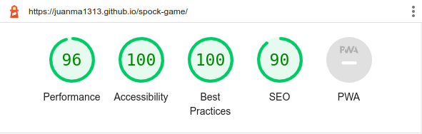

#  SPOCK-GAME

***

This is a web-site version of the famous "Rock-Paper-Scissors-Lizard-Spock" game invented by Sam Kass and Karen Bryla, and popularized in the "The Big-Bang Theory" television series.
This in turn is based on the popularly known hand game "Rock-Paper-Scissors" but with two more hand shapes to the list of weapons. The game mechanics remain the same, but the relationship between all elements is doubled in an attempt to minimise the chances of a draw.
This game represents a symbolic combat, between two or more players, where the weapons used are certain stances created with the hand of each player.  In the case of the classic "Rock-Paper-Scissors", there are 3 defined stances, each one symbolically identifying a rock, a piece of paper or a pair of scissors.
In the case of the reformed "Rock-Paper-Scissors-Lizar-Spock", there are 2 additional defined positions, each symbolically identifying a lizard and the mythical character Spock from the Star Trek series.

## The Rock-Paper-Scissors-Lizard-Spock Game
This game requires at least and preferably two players. The player's hand (either right or left) is used to represent the weapon used in each round.
Players are free to use any of the following 5 defined weapons/hand positions:
|**Rock**|**Paper**|**Scissors**|**Lizard**|**Spock**|
|:---:|:---:|:---:|:---:|:---:|
| |||||
||||||

All players must reveal their weapon at the same time and simultaneously, and the outcome of the round will be determined by the following table:

|            |**Rock**|**Paper**|**Scissors**|**Spock**|**Lizard**|
|:---:       |:---:   |:---:    |:---:       |:---:    |:---:     |
|**Rock**    |   0    |    -    |     +      |    -    |    +     |
|**Paper**   |   +    |    0    |     -      |    +    |    -     |
|**Scissors**|   -    |    +    |     0      |    -    |    +     |
|**Spock**   |   +    |    -    |     +      |    0    |    +     |
|**Lizard**  |   -    |    +    |     -      |    +    |    0     |
||||||

But it may be easier for a person to check the result by looking at the following diagram:

There is also a video clip from "The Big Bang  Theory" serie where the game gets explained: [The-Big-Bang-Theory_Clip](https://www.youtube.com/watch?v=x5Q6-wMx-K8)

***
# The User Experience
## Requirements
The design of the graphic interface of this web page tries to achieve the following objectives:
* The interface has to be simple, clear and with colors that invite you to play.
* At the beginning of the page the game instructions and configuration must be shown.
* The main page must display the following information:
    - Round number to be played
    - Players scores
    - All weapons available to all players
    - Game start button
    - Button to see the instructions
    - Button to access the game settings.
    - Information about the outcome of the round
    - Information about the winner of the game at the end of the last round
***
## Game Mechanics and Wireframes
All wireframe graphics have been created with "LibreOffice Impress", as this format is not supported by Gitpod, the corresponding screenshots are shown.

### Initial Page
When the user enters the game for the first time, the main page of the game is presented and the "instructions/settings" button is automatically activated. In this way the instructions of the game are shown and the user can put his player name, the number of rounds of the game before starting the game.

### Game Start
When the user exits the initial page, the game is ready to start. The user must explicitly start the game. Previous scores, if any, are still visible.

### Game Started
Once the game has started, the round counter is reset to 1, the scores are reset to 0, and the player must choose a weapon from his field.

### Playing the Game
After the player has chosen a weapon, the result of the contest is displayed by comparing the chosen weapon with the one selected by the computer using the rules of the game.
If the player has chosen a winning move, a point is added to his score. If, if his move is a losing one, the point is added to his opponent's score. If the move is a draw, none of the scores are updated.
The round counter is incremented and if the round limit has not been reached, the player is asked to choose a weapon again, thus starting a new round.

### The ending of the game
After all rounds have been played, a message will appear proclaiming the winner of the game.
After discarding this message, the user will be invited to start a new game.

### Playing across devices
The game does not require too much screen space, so the graphics and text can be scaled up for desktop and tablet computers, but for mobile the information must be compressed and the screen reconfigured to remain playable.
The proposed wireframe for mobile is shown below.

#Features
## Existing Features
### The Titel
This is just a banner with the name of the game.

### Game Rules
The first thing the user sees is a window with the game rules and a list of the 10 winning combinations, So the user can take a time to understand the game or simply discard the screen pressing the "Back to the game" button
 

### The start button
The user must press the start button to initiate the game.

### Game screen
Once the user has press the start button, all the scores are set to 0, the previously selected weapon is deleted and the round counter shows the current round number. The user can access the game rules pressing the rules button located at the bottom of the gaming area.
The user arena is marked with red colors, while the computer named "Spock" uses green colors. All the rest of the commin information is presented in blue.

### The weapon draw
The user can select any of the 5 hand postures that are presented at the left of his arena. Once he has clicked on it, it will triguer the weapon draw and both weapons will be displayed on their respectives arenas.
The result of the draw is also presented inmediately, the scores are updated acordingly and the round counter is increased by one.
This will be repeated for 5 times until the round 5 us comnplated in which case the final result will be presented.

### The final screem
After evaluating the scores after the 5th weapon draw, the final screen will be presented with the outcome of the duell. There are 3 possible scenarions. The player can win, he can loose or even tie with the computer. there is specific final message for each case.

### Screen adaptation to diferent devices
The application was developed in a desktop environment, but it can adapt to a smaller screen device with resolutions lower then 1024 horizontal px.
The font is scaled automatically as we reduce the screen size, and when used in lower than 1024px the screen is restructured to provide a better usability.

***

# Testing
## Validator Testing
### HTML
No errors are returned when passing through the official W3C validator
### CSS
No errors are found when passing through the official (Jigsaw) validator
### Javascript
No errors are found when passing through the official (JSHint) validator

## Performance
Only the Google Chromium Lighthouse performance test was performed on the deployed application. the following screen capture shows the result.

# Deployment
The site was deployed to GitHub pages. The steps to deploy are as follows:
In the GitHub repository, navigate to the Settings tab
From the source section drop-down menu, select the Master Branch
Once the master branch has been selected, the page will be automatically refreshed with a detailed ribbon display to indicate the successful deployment.
The live link can be found here - https://juanma1313.github.io/spock-game/

# Credits
## Information and references
* Rock-Paper-Scissors-Lizard-Spock game information was obtained from Wikipedia [Wikikedia_reference](https://en.wikipedia.org/wiki/Rock_paper_scissors)
## Images and icons
* Favicon.png - Downloaded from PNGEgg [png-mwcuq-icon](https://www.pngegg.com/en/png-mwcuq)
* jmh-*.png - Created by Juan Manuel de las Heras Arroyo.
* rock-paper-scissors-lizard-spock_aligned.svg - downloaded wrom wikipedia [rock-paper-scissors-lizard-spock diagram](https://upload.wikimedia.org/wikipedia/commons/a/ad/Pierre_ciseaux_feuille_l%C3%A9zard_spock_aligned.svg)

